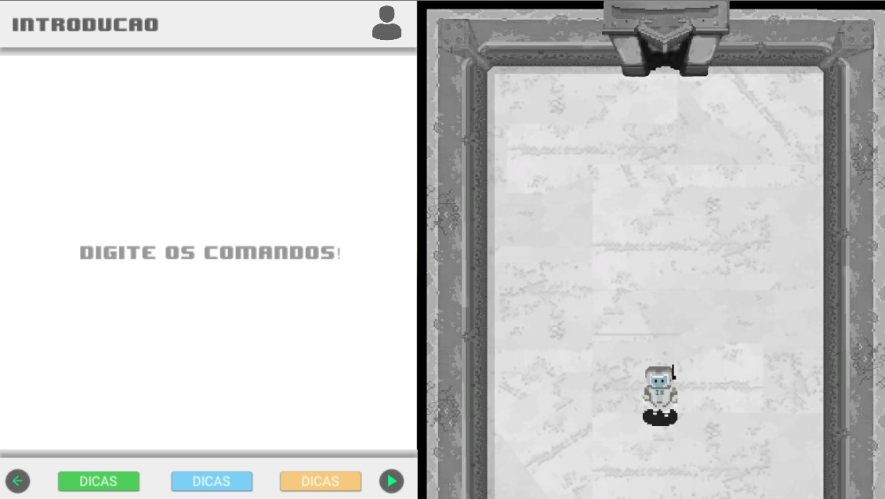
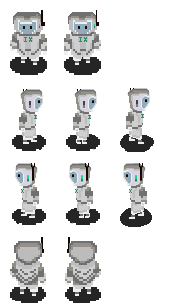

# Forrit
Trabalho de Conclusão de Curso do Instituto Federal Catarinense - Campus Avançado Sombrio; plataforma de continuidade

#Introdução

Forrit é um jogo desenvolvido em unity que possui a premissa de ensinar programação e que atualmente está em fase de desenvolvimento, o projeto foi idealizado por William Fabre e consta como trabalho de conclusão de curso de Técnico em Informática integrado ao ensino médio do Instituto Federal Catarinense Campus Avançado Sombrio.O jogo basicamente indica você a construir um programa, numa linguagem identada em português, mas com abertura de tags e construções semelhantes a linguagens de programação.

Aqui há um exemplo

# Versão 0.1

Necessário: verificar tempo das animações, adicionar maior contexto.
